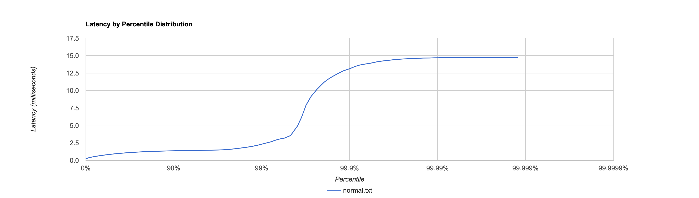
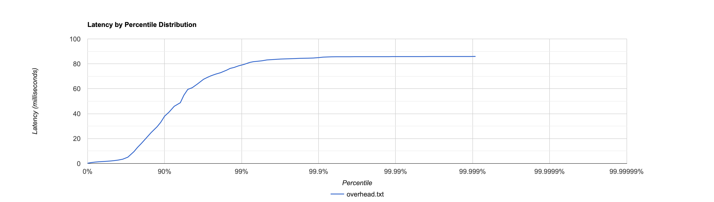
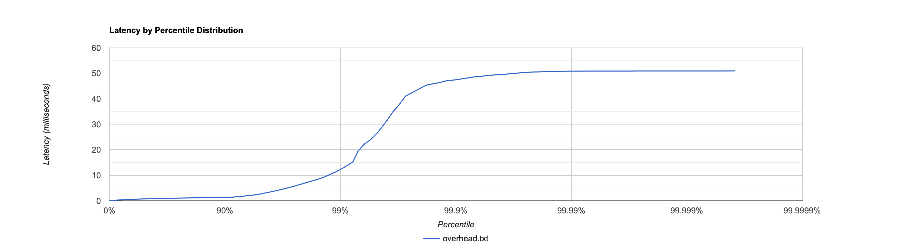
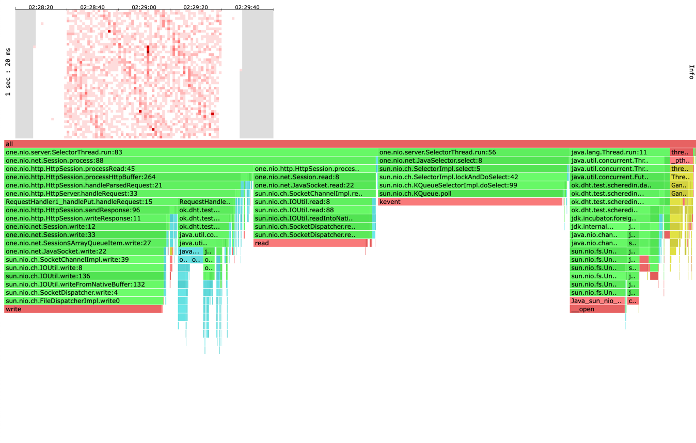
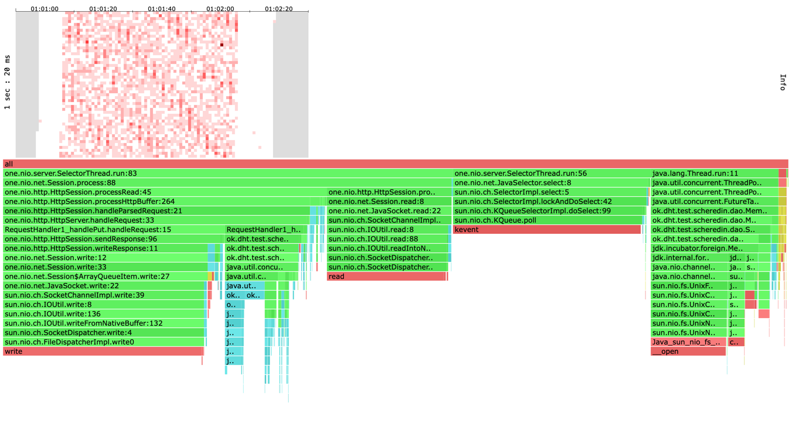

# Отчёт по первому этапу курсовой работы по дисциплине 'Разработка высоконагруженных приложений'
_выполнил Щередин Артём_


## Нагрузочное тестирование. Метод Get

База предварительно была заполнена сущностями. 
10000 сущностей по 200 Кб каждая. ~2 Гб суммарно

Далее был написан скриптик на lua, 
который создаёт запросы get к сущностям со случайными id

````
math.randomseed(os.time())
request = function()

url_path = "/v0/entity?id=" .. math.random(0,1000)
return wrk.format("GET", url_path, nil, nil)
end
````

Путём проб и ошибок было найденное значение наибольшее значение
запросов/в секунду, при котором сервер чувствует себя бодро: 3500 запр/сек.
Средняя задержка примерно равна 1 мс, 
а в среднем за секунду сервер отвечал на 3499.86 запросов.

```
wrk2 -c 1 -d 60s -t 1 -R 3500 -s ./get.lua -L http://localhost:19235

1 threads and 1 connections
Thread calibration: mean lat.: 2.847ms, rate sampling interval: 10ms
Thread Stats   Avg      Stdev     Max   +/- Stdev
Latency     1.06ms  558.68us   4.89ms   64.28%
Req/Sec     3.69k   334.35     4.67k    69.23%
Latency Distribution (HdrHistogram - Recorded Latency)
50.000%    1.04ms
75.000%    1.40ms
90.000%    1.88ms
99.000%    2.35ms
99.900%    3.16ms
99.990%    3.76ms
99.999%    4.59ms
100.000%    4.89ms

Detailed Percentile spectrum:
Value   Percentile   TotalCount 1/(1-Percentile)

       0.057     0.000000            1         1.00
       0.343     0.100000        17552         1.11
       0.536     0.200000        35073         1.25
       0.716     0.300000        52537         1.43
       0.884     0.400000        70033         1.67
       1.036     0.500000        87561         2.00
       1.102     0.550000        96278         2.22
       1.164     0.600000       105053         2.50
       1.225     0.650000       113875         2.86
       1.294     0.700000       122517         3.33
       1.401     0.750000       131246         4.00
       1.470     0.775000       135655         4.44
       1.544     0.800000       140022         5.00
       1.621     0.825000       144362         5.71
       1.705     0.850000       148783         6.67
       1.791     0.875000       153146         8.00
       1.835     0.887500       155346         8.89
       1.881     0.900000       157497        10.00
       1.927     0.912500       159691        11.43
       1.974     0.925000       161886        13.33
       2.024     0.937500       164075        16.00
       2.049     0.943750       165138        17.78
       2.077     0.950000       166301        20.00
       2.105     0.956250       167395        22.86
       2.133     0.962500       168478        26.67
       2.165     0.968750       169525        32.00
       2.183     0.971875       170070        35.56
       2.201     0.975000       170629        40.00
       2.221     0.978125       171194        45.71
       2.243     0.981250       171739        53.33
       2.267     0.984375       172261        64.00
       2.283     0.985938       172524        71.11
       2.301     0.987500       172799        80.00
       2.325     0.989062       173073        91.43
       2.357     0.990625       173356       106.67
       2.393     0.992188       173636       128.00
       2.415     0.992969       173758       142.22
       2.443     0.993750       173892       160.00
       2.473     0.994531       174024       182.86
       2.517     0.995313       174159       213.33
       2.573     0.996094       174297       256.00
       2.613     0.996484       174364       284.44
       2.657     0.996875       174433       320.00
       2.715     0.997266       174501       365.71
       2.787     0.997656       174570       426.67
       2.861     0.998047       174638       512.00
       2.909     0.998242       174673       568.89
       2.977     0.998437       174707       640.00
       3.051     0.998633       174740       731.43
       3.101     0.998828       174774       853.33
       3.175     0.999023       174809      1024.00
       3.211     0.999121       174826      1137.78
       3.257     0.999219       174843      1280.00
       3.307     0.999316       174860      1462.86
       3.355     0.999414       174877      1706.67
       3.411     0.999512       174895      2048.00
       3.447     0.999561       174903      2275.56
       3.465     0.999609       174911      2560.00
       3.491     0.999658       174920      2925.71
       3.525     0.999707       174928      3413.33
       3.581     0.999756       174937      4096.00
       3.609     0.999780       174941      4551.11
       3.645     0.999805       174945      5120.00
       3.661     0.999829       174952      5851.43
       3.681     0.999854       174954      6826.67
       3.687     0.999878       174958      8192.00
       3.719     0.999890       174960      9102.22
       3.759     0.999902       174962     10240.00
       3.775     0.999915       174965     11702.86
       3.807     0.999927       174967     13653.33
       3.829     0.999939       174969     16384.00
       3.845     0.999945       174971     18204.44
       3.845     0.999951       174971     20480.00
       3.853     0.999957       174972     23405.71
       3.859     0.999963       174973     27306.67
       4.047     0.999969       174974     32768.00
       4.235     0.999973       174975     36408.89
       4.235     0.999976       174975     40960.00
       4.431     0.999979       174976     46811.43
       4.431     0.999982       174976     54613.33
       4.587     0.999985       174977     65536.00
       4.587     0.999986       174977     72817.78
       4.587     0.999988       174977     81920.00
       4.699     0.999989       174978     93622.86
       4.699     0.999991       174978    109226.67
       4.699     0.999992       174978    131072.00
       4.699     0.999993       174978    145635.56
       4.699     0.999994       174978    163840.00
       4.891     0.999995       174979    187245.71
       4.891     1.000000       174979          inf
#[Mean    =        1.063, StdDeviation   =        0.559]
#[Max     =        4.888, Total count    =       174979]
#[Buckets =           27, SubBuckets     =         2048]
----------------------------------------------------------
209993 requests in 1.00m, 13.22MB read
Non-2xx or 3xx responses: 419
Requests/sec:   3499.86
Transfer/sec:    225.60KB
```
При увеличении количества запросов до 4000 в секунду, сервер не справлялся
---
```
wrk2 -c 1 -d 60s -t 1 -R 4000 -s ./get.lua -L http://localhost:19235
Running 1m test @ http://localhost:19235
1 threads and 1 connections
Thread calibration: mean lat.: 6.783ms, rate sampling interval: 36ms
Thread Stats   Avg      Stdev     Max   +/- Stdev
Latency    10.58ms   18.21ms  85.89ms   87.09%
Req/Sec     4.06k   181.27     4.43k    78.24%
Latency Distribution (HdrHistogram - Recorded Latency)
50.000%    2.02ms
75.000%    9.53ms
90.000%   37.98ms
99.000%   79.04ms
99.900%   84.99ms
99.990%   85.82ms
99.999%   85.89ms
100.000%   85.95ms

Detailed Percentile spectrum:
Value   Percentile   TotalCount 1/(1-Percentile)

       0.223     0.000000            2         1.00
       0.725     0.100000        20009         1.11
       1.127     0.200000        40009         1.25
       1.422     0.300000        60028         1.43
       1.667     0.400000        80002         1.67
       2.024     0.500000        99988         2.00
       2.319     0.550000       109975         2.22
       2.751     0.600000       119943         2.50
       3.455     0.650000       129938         2.86
       5.075     0.700000       139932         3.33
       9.535     0.750000       149934         4.00
      12.871     0.775000       154928         4.44
      16.159     0.800000       159926         5.00
      20.111     0.825000       164922         5.71
      24.767     0.850000       169915         6.67
      29.551     0.875000       174920         8.00
      33.023     0.887500       177417         8.89
      37.983     0.900000       179931        10.00
      41.279     0.912500       182428        11.43
      45.919     0.925000       184923        13.33
      48.799     0.937500       187433        16.00
      54.783     0.943750       188657        17.78
      59.487     0.950000       189914        20.00
      60.863     0.956250       191156        22.86
      63.807     0.962500       192413        26.67
      67.583     0.968750       193666        32.00
      68.991     0.971875       194283        35.56
      70.399     0.975000       194915        40.00
      71.679     0.978125       195527        45.71
      72.895     0.981250       196182        53.33
      74.943     0.984375       196780        64.00
      76.351     0.985938       197088        71.11
      77.119     0.987500       197409        80.00
      78.399     0.989062       197736        91.43
      79.487     0.990625       198028       106.67
      81.151     0.992188       198360       128.00
      81.727     0.992969       198519       142.22
      82.047     0.993750       198660       160.00
      82.431     0.994531       198806       182.86
      83.135     0.995313       198976       213.33
      83.455     0.996094       199138       256.00
      83.647     0.996484       199221       284.44
      83.839     0.996875       199300       320.00
      83.967     0.997266       199374       365.71
      84.095     0.997656       199434       426.67
      84.287     0.998047       199522       512.00
      84.415     0.998242       199557       568.89
      84.479     0.998437       199602       640.00
      84.543     0.998633       199631       731.43
      84.671     0.998828       199676       853.33
      85.055     0.999023       199705      1024.00
      85.375     0.999121       199726      1137.78
      85.503     0.999219       199746      1280.00
      85.631     0.999316       199779      1462.86
      85.695     0.999414       199827      1706.67
      85.695     0.999512       199827      2048.00
      85.695     0.999561       199827      2275.56
      85.695     0.999609       199827      2560.00
      85.759     0.999658       199875      2925.71
      85.759     0.999707       199875      3413.33
      85.759     0.999756       199875      4096.00
      85.759     0.999780       199875      4551.11
      85.759     0.999805       199875      5120.00
      85.759     0.999829       199875      5851.43
      85.759     0.999854       199875      6826.67
      85.759     0.999878       199875      8192.00
      85.823     0.999890       199891      9102.22
      85.823     0.999902       199891     10240.00
      85.823     0.999915       199891     11702.86
      85.823     0.999927       199891     13653.33
      85.823     0.999939       199891     16384.00
      85.823     0.999945       199891     18204.44
      85.823     0.999951       199891     20480.00
      85.823     0.999957       199891     23405.71
      85.887     0.999963       199897     27306.67
      85.887     0.999969       199897     32768.00
      85.887     0.999973       199897     36408.89
      85.887     0.999976       199897     40960.00
      85.887     0.999979       199897     46811.43
      85.887     0.999982       199897     54613.33
      85.887     0.999985       199897     65536.00
      85.887     0.999986       199897     72817.78
      85.887     0.999988       199897     81920.00
      85.887     0.999989       199897     93622.86
      85.951     0.999991       199899    109226.67
      85.951     1.000000       199899          inf
#[Mean    =       10.583, StdDeviation   =       18.206]
#[Max     =       85.888, Total count    =       199899]
#[Buckets =           27, SubBuckets     =         2048]
----------------------------------------------------------
239914 requests in 1.00m, 15.79MB read
Non-2xx or 3xx responses: 239914
Requests/sec:   3998.58
Transfer/sec:    269.44KB
```

### Нормальная нагрузка



[Хитмап](./htmls/get_3500R.html)


### Повышенная



[Хитмап](./htmls/get_4000R.html)

---

 По графикам видно, что  
- при нормальной нагрузке ответ на запрос будет с вероятностью 99 процентов
будет получен меньше чем за 2.5 мс.
- При повышенной нагрузке уже на 75 персентиле 
задержка составляет 9.53 мс, а на 99 составляет неприемлемые 79 мс.

 На флеймграфах видно, что при нормальной нагрузке:
- Большая часть процессорного времени тратится Dao - 65 процента. Это метод get - извлечения сущености из базы.
- Оставшиеся проценты приходятся на one-nio: работу с сетью. 
На хитмапе можно увидеть контрастно-красные сэмплы.
Это вызовы нативных функций pthread_start - стартует новый поток.

 При повышенной нагрузке видно, что дао отнимает гораздо больше процессорного времени,
чем в штатном режиме в отношении операций one-nio. На хитмапе всё ещё есть красные семплы, которые
соотносятся с вызовом нативной функции pthread_start.

## Нагрузочное тестирование. Метод Put

Скрипт на lua:
Генерирует put запросы с рандомными id

```
math.randomseed(os.time())
request = function()

url_path = "/v0/entity?id=" .. math.random(0,1000000)
return wrk.format("PUT", url_path, nil, "test")
end
```

Значение параметра -R, при котором сервер работает нормальное, - 15000R. 
Средняя задержка в таком случае меньше 1 мс

```
 1 threads and 1 connections
  Thread calibration: mean lat.: 1.124ms, rate sampling interval: 10ms
  Thread Stats   Avg      Stdev     Max   +/- Stdev
    Latency   642.52us  362.67us   3.83ms   61.87%
    Req/Sec    15.87k     1.09k   20.44k    65.72%
  Latency Distribution (HdrHistogram - Recorded Latency)
 50.000%  639.00us
 75.000%    0.93ms
 90.000%    1.10ms
 99.000%    1.33ms
 99.900%    2.77ms
 99.990%    3.70ms
 99.999%    3.80ms
100.000%    3.84ms

  Detailed Percentile spectrum:
       Value   Percentile   TotalCount 1/(1-Percentile)

       0.034     0.000000           12         1.00
       0.162     0.100000        75605         1.11
       0.282     0.200000       150601         1.25
       0.402     0.300000       225537         1.43
       0.521     0.400000       300397         1.67
       0.639     0.500000       375066         2.00
       0.698     0.550000       412683         2.22
       0.757     0.600000       450421         2.50
       0.815     0.650000       487713         2.86
       0.873     0.700000       525210         3.33
       0.931     0.750000       562925         4.00
       0.959     0.775000       581245         4.44
       0.988     0.800000       600223         5.00
       1.017     0.825000       619243         5.71
       1.045     0.850000       637773         6.67
       1.073     0.875000       656366         8.00
       1.087     0.887500       665641         8.89
       1.102     0.900000       675341        10.00
       1.116     0.912500       684414        11.43
       1.131     0.925000       694100        13.33
       1.146     0.937500       703694        16.00
       1.153     0.943750       708224        17.78
       1.160     0.950000       712889        20.00
       1.167     0.956250       717379        22.86
       1.174     0.962500       721818        26.67
       1.183     0.968750       726899        32.00
       1.188     0.971875       728953        35.56
       1.195     0.975000       731173        40.00
       1.205     0.978125       733582        45.71
       1.220     0.981250       735961        53.33
       1.242     0.984375       738264        64.00
       1.257     0.985938       739377        71.11
       1.277     0.987500       740545        80.00
       1.307     0.989062       741747        91.43
       1.346     0.990625       742893       106.67
       1.405     0.992188       744061       128.00
       1.450     0.992969       744660       142.22
       1.504     0.993750       745233       160.00
       1.576     0.994531       745816       182.86
       1.670     0.995313       746404       213.33
       1.801     0.996094       746990       256.00
       1.879     0.996484       747282       284.44
       1.970     0.996875       747576       320.00
       2.079     0.997266       747867       365.71
       2.211     0.997656       748160       426.67
       2.337     0.998047       748453       512.00
       2.427     0.998242       748599       568.89
       2.507     0.998437       748745       640.00
       2.591     0.998633       748892       731.43
       2.675     0.998828       749038       853.33
       2.779     0.999023       749184      1024.00
       2.833     0.999121       749258      1137.78
       2.903     0.999219       749334      1280.00
       2.981     0.999316       749404      1462.86
       3.061     0.999414       749477      1706.67
       3.149     0.999512       749550      2048.00
       3.217     0.999561       749588      2275.56
       3.259     0.999609       749624      2560.00
       3.313     0.999658       749661      2925.71
       3.403     0.999707       749697      3413.33
       3.513     0.999756       749733      4096.00
       3.559     0.999780       749753      4551.11
       3.585     0.999805       749770      5120.00
       3.613     0.999829       749788      5851.43
       3.657     0.999854       749807      6826.67
       3.681     0.999878       749826      8192.00
       3.693     0.999890       749837      9102.22
       3.699     0.999902       749844     10240.00
       3.713     0.999915       749852     11702.86
       3.723     0.999927       749864     13653.33
       3.731     0.999939       749873     16384.00
       3.733     0.999945       749876     18204.44
       3.735     0.999951       749880     20480.00
       3.741     0.999957       749884     23405.71
       3.749     0.999963       749889     27306.67
       3.755     0.999969       749896     32768.00
       3.755     0.999973       749896     36408.89
       3.759     0.999976       749898     40960.00
       3.765     0.999979       749900     46811.43
       3.773     0.999982       749903     54613.33
       3.777     0.999985       749905     65536.00
       3.781     0.999986       749906     72817.78
       3.785     0.999988       749907     81920.00
       3.791     0.999989       749908     93622.86
       3.801     0.999991       749910    109226.67
       3.807     0.999992       749912    131072.00
       3.807     0.999993       749912    145635.56
       3.807     0.999994       749912    163840.00
       3.807     0.999995       749912    187245.71
       3.821     0.999995       749913    218453.33
       3.825     0.999996       749914    262144.00
       3.825     0.999997       749914    291271.11
       3.825     0.999997       749914    327680.00
       3.825     0.999997       749914    374491.43
       3.829     0.999998       749915    436906.67
       3.829     0.999998       749915    524288.00
       3.829     0.999998       749915    582542.22
       3.829     0.999998       749915    655360.00
       3.829     0.999999       749915    748982.86
       3.835     0.999999       749916    873813.33
       3.835     1.000000       749916          inf
#[Mean    =        0.643, StdDeviation   =        0.363]
#[Max     =        3.834, Total count    =       749916]
#[Buckets =           27, SubBuckets     =         2048]
----------------------------------------------------------
  899974 requests in 1.00m, 59.22MB read
  Non-2xx or 3xx responses: 899974
Requests/sec:  14999.62
Transfer/sec:      0.99MB
```

Пробуем повысить нагрузку на 5 тысяч запросов. -R 21000

```
wrk2 -c 1 -d 60s -t 1 -s src/main/java/ok/dht/test/scheredin/report/scripts/put.lua -R 21000 -L http://localhost:19235
Running 1m test @ http://localhost:19235
  1 threads and 1 connections
  Thread calibration: mean lat.: 243.424ms, rate sampling interval: 823ms
  Thread Stats   Avg      Stdev     Max   +/- Stdev
    Latency   284.85ms  242.97ms 979.97ms   58.98%
    Req/Sec    20.81k     1.30k   23.55k    70.00%
  Latency Distribution (HdrHistogram - Recorded Latency)
 50.000%  247.81ms
 75.000%  421.89ms
 90.000%  593.92ms
 99.000%  919.55ms
 99.900%  973.31ms
 99.990%  979.97ms
 99.999%  980.48ms
100.000%  980.48ms

  Detailed Percentile spectrum:
       Value   Percentile   TotalCount 1/(1-Percentile)

       0.035     0.000000            4         1.00
       1.063     0.100000       103878         1.11
       9.655     0.200000       207709         1.25
     135.039     0.300000       311544         1.43
     190.975     0.400000       415555         1.67
     247.807     0.500000       519370         2.00
     298.495     0.550000       571653         2.22
     323.327     0.600000       623730         2.50
     344.063     0.650000       675292         2.86
     379.903     0.700000       727168         3.33
     421.887     0.750000       778866         4.00
     459.263     0.775000       804822         4.44
     490.751     0.800000       830967         5.00
     520.959     0.825000       856705         5.71
     549.375     0.850000       882865         6.67
     561.663     0.875000       909284         8.00
     570.879     0.887500       921775         8.89
     593.919     0.900000       934792        10.00
     615.423     0.912500       947586        11.43
     653.823     0.925000       960605        13.33
     759.295     0.937500       973535        16.00
     820.223     0.943750       980070        17.78
     835.071     0.950000       986697        20.00
     850.431     0.956250       993121        22.86
     859.135     0.962500       999891        26.67
     863.231     0.968750      1006306        32.00
     865.279     0.971875      1009399        35.56
     872.959     0.975000      1012504        40.00
     879.615     0.978125      1015823        45.71
     899.583     0.981250      1019142        53.33
     906.751     0.984375      1022301        64.00
     910.335     0.985938      1023920        71.11
     913.919     0.987500      1025842        80.00
     916.991     0.989062      1027148        91.43
     921.087     0.990625      1028841       106.67
     925.695     0.992188      1030356       128.00
     932.863     0.992969      1031138       142.22
     940.031     0.993750      1031936       160.00
     948.223     0.994531      1032796       182.86
     952.831     0.995313      1033576       213.33
     957.439     0.996094      1034372       256.00
     959.999     0.996484      1034857       284.44
     961.535     0.996875      1035181       320.00
     964.095     0.997266      1035616       365.71
     967.167     0.997656      1036037       426.67
     969.215     0.998047      1036490       512.00
     969.727     0.998242      1036637       568.89
     970.239     0.998437      1036852       640.00
     971.775     0.998633      1037189       731.43
     972.287     0.998828      1037337       853.33
     974.335     0.999023      1037437      1024.00
     975.359     0.999121      1037513      1137.78
     976.895     0.999219      1037638      1280.00
     977.407     0.999316      1037869      1462.86
     977.407     0.999414      1037869      1706.67
     977.919     0.999512      1037924      2048.00
     978.431     0.999561      1038139      2275.56
     978.431     0.999609      1038139      2560.00
     978.431     0.999658      1038139      2925.71
     978.431     0.999707      1038139      3413.33
     978.943     0.999756      1038236      4096.00
     978.943     0.999780      1038236      4551.11
     978.943     0.999805      1038236      5120.00
     979.455     0.999829      1038282      5851.43
     979.455     0.999854      1038282      6826.67
     979.967     0.999878      1038339      8192.00
     979.967     0.999890      1038339      9102.22
     979.967     0.999902      1038339     10240.00
     979.967     0.999915      1038339     11702.86
     980.479     0.999927      1038424     13653.33
     980.479     1.000000      1038424          inf
#[Mean    =      284.847, StdDeviation   =      242.966]
#[Max     =      979.968, Total count    =      1038424]
#[Buckets =           27, SubBuckets     =         2048]
----------------------------------------------------------
  1239405 requests in 1.00m, 81.56MB read
  Non-2xx or 3xx responses: 1239405
Requests/sec:  20656.88
Transfer/sec:      1.36MB

```

### Нормальная нагрузка



[Хитмап](./htmls/put_15000R.html)


### Повышенная



[Хитмап](./htmls/put_21000R.html)

---

### Анализ графиков

При нормальной нагрузке сервер отвечает в среднем за 600 микросекунд, максимальное время ответа составило 3.83 мс.
99ый персентиль соответствует задержке в 1.33 мс. В среднем за секунду сервер обратывал 14999.62 запросов.
Хорошие показатели, сервер работает стабильно с низкой задержкой.

При повышенной нагрузке сервер отвечает в среднем за 400 миллисекунд, максимальное время ответа почти секнуда.
99ый персентиль соответствует задержке в 919.55 мс. В среднем за секунду сервер обратывал 20656.88 запросов.
Сервер не справляется с нагрузкой.

### Анализ хитмап
Кроме того появились красноватые полосы на хитмапе. При сравнении участков с этими полосами и без, можно понять причину.
В Dao запускается метод flushInBg, который скидывает все данные, хранящиеся в памяти, на диск. 
При нормальной нагрузке флаш занял 15 процентов всего времени, при повышенной - 16.
27% времени занимают операции класса SelectorThread, в нём SelectImpl.select блокирует выполнение.
Ещё 17% приходятся на операции чтения из сокетов и 23% процентов на запись. 
Наконец 7% занимают вставки в Dao.
При повышенной нагрузке примерно похожее процентное соотношение распределения процессорного времени.
