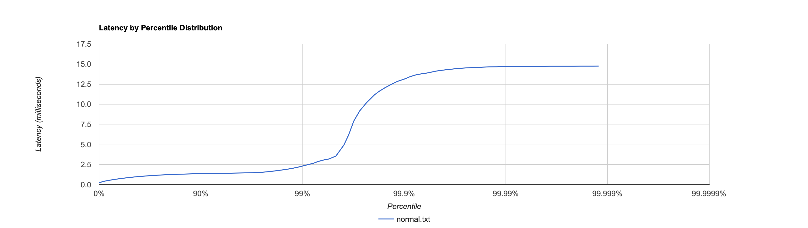
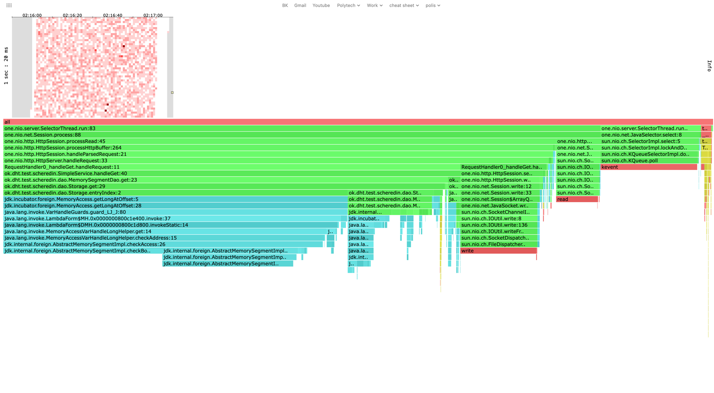
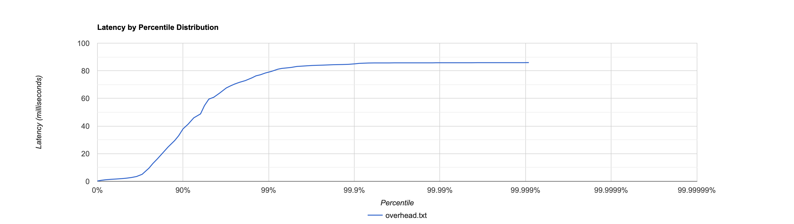
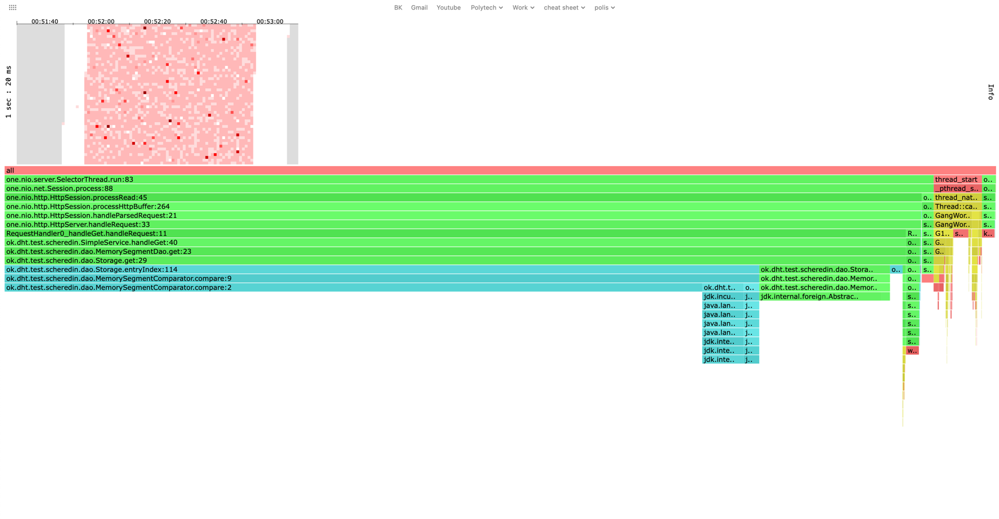

# Отчёт по первому этапу курсовой работы по дисциплине 'Разработка высоконагруженных приложений'
выполнил Щередин Артём


## Нагрузочное тестирование. Метод Get

База предварительно была заполнена сущностями. 
10000 сущностей по 200 Кб каждая. ~2 Гб суммарно

Далее был написан скриптик на lua, 
который создаёт запросы get к сущностям со случайными id

math.randomseed(os.time())
request = function()

url_path = "/v0/entity?id=" .. math.random(0,1000)
return wrk.format("GET", url_path, nil, nil)
end

Путём проб и ошибок было найденное значение наибольшее значение
запросов/в секунду, при котором сервер чувствует себя бодро: 3500 запр/сек.
Средняя задержка примерно равна 1 мс, 
а в среднем за секунду сервер отвечал на 3499.86 запросов.

```
wrk2 -c 1 -d 60s -t 1 -R 3500 -s ./get.lua -L http://localhost:19235

1 threads and 1 connections
Thread calibration: mean lat.: 2.847ms, rate sampling interval: 10ms
Thread Stats   Avg      Stdev     Max   +/- Stdev
Latency     1.06ms  558.68us   4.89ms   64.28%
Req/Sec     3.69k   334.35     4.67k    69.23%
Latency Distribution (HdrHistogram - Recorded Latency)
50.000%    1.04ms
75.000%    1.40ms
90.000%    1.88ms
99.000%    2.35ms
99.900%    3.16ms
99.990%    3.76ms
99.999%    4.59ms
100.000%    4.89ms

Detailed Percentile spectrum:
Value   Percentile   TotalCount 1/(1-Percentile)

       0.057     0.000000            1         1.00
       0.343     0.100000        17552         1.11
       0.536     0.200000        35073         1.25
       0.716     0.300000        52537         1.43
       0.884     0.400000        70033         1.67
       1.036     0.500000        87561         2.00
       1.102     0.550000        96278         2.22
       1.164     0.600000       105053         2.50
       1.225     0.650000       113875         2.86
       1.294     0.700000       122517         3.33
       1.401     0.750000       131246         4.00
       1.470     0.775000       135655         4.44
       1.544     0.800000       140022         5.00
       1.621     0.825000       144362         5.71
       1.705     0.850000       148783         6.67
       1.791     0.875000       153146         8.00
       1.835     0.887500       155346         8.89
       1.881     0.900000       157497        10.00
       1.927     0.912500       159691        11.43
       1.974     0.925000       161886        13.33
       2.024     0.937500       164075        16.00
       2.049     0.943750       165138        17.78
       2.077     0.950000       166301        20.00
       2.105     0.956250       167395        22.86
       2.133     0.962500       168478        26.67
       2.165     0.968750       169525        32.00
       2.183     0.971875       170070        35.56
       2.201     0.975000       170629        40.00
       2.221     0.978125       171194        45.71
       2.243     0.981250       171739        53.33
       2.267     0.984375       172261        64.00
       2.283     0.985938       172524        71.11
       2.301     0.987500       172799        80.00
       2.325     0.989062       173073        91.43
       2.357     0.990625       173356       106.67
       2.393     0.992188       173636       128.00
       2.415     0.992969       173758       142.22
       2.443     0.993750       173892       160.00
       2.473     0.994531       174024       182.86
       2.517     0.995313       174159       213.33
       2.573     0.996094       174297       256.00
       2.613     0.996484       174364       284.44
       2.657     0.996875       174433       320.00
       2.715     0.997266       174501       365.71
       2.787     0.997656       174570       426.67
       2.861     0.998047       174638       512.00
       2.909     0.998242       174673       568.89
       2.977     0.998437       174707       640.00
       3.051     0.998633       174740       731.43
       3.101     0.998828       174774       853.33
       3.175     0.999023       174809      1024.00
       3.211     0.999121       174826      1137.78
       3.257     0.999219       174843      1280.00
       3.307     0.999316       174860      1462.86
       3.355     0.999414       174877      1706.67
       3.411     0.999512       174895      2048.00
       3.447     0.999561       174903      2275.56
       3.465     0.999609       174911      2560.00
       3.491     0.999658       174920      2925.71
       3.525     0.999707       174928      3413.33
       3.581     0.999756       174937      4096.00
       3.609     0.999780       174941      4551.11
       3.645     0.999805       174945      5120.00
       3.661     0.999829       174952      5851.43
       3.681     0.999854       174954      6826.67
       3.687     0.999878       174958      8192.00
       3.719     0.999890       174960      9102.22
       3.759     0.999902       174962     10240.00
       3.775     0.999915       174965     11702.86
       3.807     0.999927       174967     13653.33
       3.829     0.999939       174969     16384.00
       3.845     0.999945       174971     18204.44
       3.845     0.999951       174971     20480.00
       3.853     0.999957       174972     23405.71
       3.859     0.999963       174973     27306.67
       4.047     0.999969       174974     32768.00
       4.235     0.999973       174975     36408.89
       4.235     0.999976       174975     40960.00
       4.431     0.999979       174976     46811.43
       4.431     0.999982       174976     54613.33
       4.587     0.999985       174977     65536.00
       4.587     0.999986       174977     72817.78
       4.587     0.999988       174977     81920.00
       4.699     0.999989       174978     93622.86
       4.699     0.999991       174978    109226.67
       4.699     0.999992       174978    131072.00
       4.699     0.999993       174978    145635.56
       4.699     0.999994       174978    163840.00
       4.891     0.999995       174979    187245.71
       4.891     1.000000       174979          inf
#[Mean    =        1.063, StdDeviation   =        0.559]
#[Max     =        4.888, Total count    =       174979]
#[Buckets =           27, SubBuckets     =         2048]
----------------------------------------------------------
209993 requests in 1.00m, 13.22MB read
Non-2xx or 3xx responses: 419
Requests/sec:   3499.86
Transfer/sec:    225.60KB
```

При увеличении количества запросов до 4000 в секунду, сервер не справлялся

```
wrk2 -c 1 -d 60s -t 1 -R 4000 -s ./get.lua -L http://localhost:19235
Running 1m test @ http://localhost:19235
1 threads and 1 connections
Thread calibration: mean lat.: 6.783ms, rate sampling interval: 36ms
Thread Stats   Avg      Stdev     Max   +/- Stdev
Latency    10.58ms   18.21ms  85.89ms   87.09%
Req/Sec     4.06k   181.27     4.43k    78.24%
Latency Distribution (HdrHistogram - Recorded Latency)
50.000%    2.02ms
75.000%    9.53ms
90.000%   37.98ms
99.000%   79.04ms
99.900%   84.99ms
99.990%   85.82ms
99.999%   85.89ms
100.000%   85.95ms

Detailed Percentile spectrum:
Value   Percentile   TotalCount 1/(1-Percentile)

       0.223     0.000000            2         1.00
       0.725     0.100000        20009         1.11
       1.127     0.200000        40009         1.25
       1.422     0.300000        60028         1.43
       1.667     0.400000        80002         1.67
       2.024     0.500000        99988         2.00
       2.319     0.550000       109975         2.22
       2.751     0.600000       119943         2.50
       3.455     0.650000       129938         2.86
       5.075     0.700000       139932         3.33
       9.535     0.750000       149934         4.00
      12.871     0.775000       154928         4.44
      16.159     0.800000       159926         5.00
      20.111     0.825000       164922         5.71
      24.767     0.850000       169915         6.67
      29.551     0.875000       174920         8.00
      33.023     0.887500       177417         8.89
      37.983     0.900000       179931        10.00
      41.279     0.912500       182428        11.43
      45.919     0.925000       184923        13.33
      48.799     0.937500       187433        16.00
      54.783     0.943750       188657        17.78
      59.487     0.950000       189914        20.00
      60.863     0.956250       191156        22.86
      63.807     0.962500       192413        26.67
      67.583     0.968750       193666        32.00
      68.991     0.971875       194283        35.56
      70.399     0.975000       194915        40.00
      71.679     0.978125       195527        45.71
      72.895     0.981250       196182        53.33
      74.943     0.984375       196780        64.00
      76.351     0.985938       197088        71.11
      77.119     0.987500       197409        80.00
      78.399     0.989062       197736        91.43
      79.487     0.990625       198028       106.67
      81.151     0.992188       198360       128.00
      81.727     0.992969       198519       142.22
      82.047     0.993750       198660       160.00
      82.431     0.994531       198806       182.86
      83.135     0.995313       198976       213.33
      83.455     0.996094       199138       256.00
      83.647     0.996484       199221       284.44
      83.839     0.996875       199300       320.00
      83.967     0.997266       199374       365.71
      84.095     0.997656       199434       426.67
      84.287     0.998047       199522       512.00
      84.415     0.998242       199557       568.89
      84.479     0.998437       199602       640.00
      84.543     0.998633       199631       731.43
      84.671     0.998828       199676       853.33
      85.055     0.999023       199705      1024.00
      85.375     0.999121       199726      1137.78
      85.503     0.999219       199746      1280.00
      85.631     0.999316       199779      1462.86
      85.695     0.999414       199827      1706.67
      85.695     0.999512       199827      2048.00
      85.695     0.999561       199827      2275.56
      85.695     0.999609       199827      2560.00
      85.759     0.999658       199875      2925.71
      85.759     0.999707       199875      3413.33
      85.759     0.999756       199875      4096.00
      85.759     0.999780       199875      4551.11
      85.759     0.999805       199875      5120.00
      85.759     0.999829       199875      5851.43
      85.759     0.999854       199875      6826.67
      85.759     0.999878       199875      8192.00
      85.823     0.999890       199891      9102.22
      85.823     0.999902       199891     10240.00
      85.823     0.999915       199891     11702.86
      85.823     0.999927       199891     13653.33
      85.823     0.999939       199891     16384.00
      85.823     0.999945       199891     18204.44
      85.823     0.999951       199891     20480.00
      85.823     0.999957       199891     23405.71
      85.887     0.999963       199897     27306.67
      85.887     0.999969       199897     32768.00
      85.887     0.999973       199897     36408.89
      85.887     0.999976       199897     40960.00
      85.887     0.999979       199897     46811.43
      85.887     0.999982       199897     54613.33
      85.887     0.999985       199897     65536.00
      85.887     0.999986       199897     72817.78
      85.887     0.999988       199897     81920.00
      85.887     0.999989       199897     93622.86
      85.951     0.999991       199899    109226.67
      85.951     1.000000       199899          inf
#[Mean    =       10.583, StdDeviation   =       18.206]
#[Max     =       85.888, Total count    =       199899]
#[Buckets =           27, SubBuckets     =         2048]
----------------------------------------------------------
239914 requests in 1.00m, 15.79MB read
Non-2xx or 3xx responses: 239914
Requests/sec:   3998.58
Transfer/sec:    269.44KB
```

### Нормальная нагрузка



[Хитмап](./htmls/get_3500R.html)


### Повышенная



[Хитмап](./htmls/get_4000R.html)

По графикам видно, что при нормальной нагрузке 
ответ на запрос будет с вероятностью 99 процентов
будет получен меньше чем за 2.5 мс. 
При повышенной нагрузке уже на 75 персентиле 
задержка составляет 9.53 мс, а на 99 составляет неприемлемые 79 мс.

На флеймграфах видно, что при нормальной нагрузке:
*Большая часть процессорного времени тратится Dao - 65 процента. Это метод get - извлечения сущености из базы.
*Оставшиеся проценты приходятся на one-nio: работу с сетью
 При повышенной нагрузке дао нагружает сервер гораздо сильнее чем при нормальной работе сервера.

## Нагрузочное тестирование. Метод Put

Скрипт на lua:
Генерирует put запросы с рандомными id

```
math.randomseed(os.time())
request = function()

url_path = "/v0/entity?id=" .. math.random(0,1000000)
return wrk.format("PUT", url_path, nil, "test")
end
```

Количе
